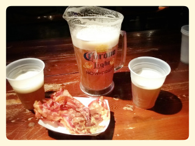

# BeerJS Hudson

BeerJS Hudson is a gathering group for Hudson County JavaScripters (NYC JavaScripters and visitors welcomed!) to get together for activities revolving around two things, beer and JavaScript!  Currently we organize events at [meetup.com/Hudson-County-JavaScript-Meetup](http://www.meetup.com/Hudson-County-JavaScript-Meetup), but we're experimenting here as well.

## Want to join?

Click the watch button on this repo (star us too!) to get notified of upcoming meeting dates or date and location changes.  Also, join [meetup.com/Hudson-County-JavaScript-Meetup](http://www.meetup.com/Hudson-County-JavaScript-Meetup), and keep your eye on the ['Meetup' label](https://github.com/beerjs/jc/issues?labels=meetup&page=1&state=open).

## Want to help?

Submit a Pull Request, file an Issue, or edit the Wiki.

## Why Github?

* Github is a more natural social network for a group of developers than Meetup.com.  
* Less spam
* Because Github is free and [Meetup.com is not](http://www.meetup.com/help/Does-it-cost-money-to-start-a-Meetup-Group), which means more beer money!

## Organizers

* Carlos Justiniano ([Github](https://github.com/cjus) / [Twitter](https://twitter.com/cjus))
* [Your name here ;-)]

## Questions?
----------
Hit me up: carlos.justiniano@gmail.com
